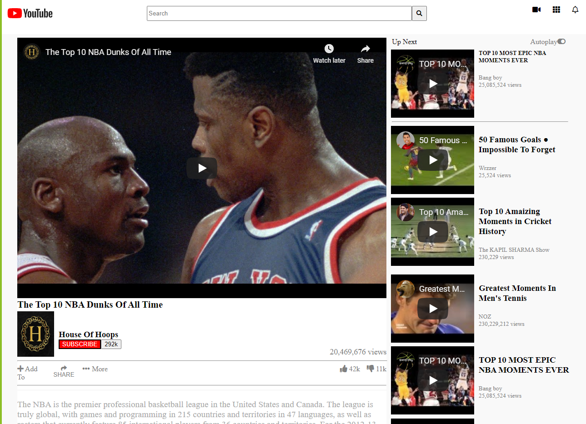

# Video Player Page

YouTube Clone

Additional description about the project and its features.

## Built With

- HTML,
- CSS,

## Live Demo

[Live Demo Link](https://cvilla714.github.io/YouTube/)

## Getting Started

**This is an example of how you may give instructions on setting up your project locally.**
**Modify this file to match your project, remove sections that don't apply. For example: delete the testing section if the currect project doesn't require testing.**

To get a local copy up and running follow these simple example steps.

👤 **Author1**

- Github: [@githubhandle](https://github.com/cvilla714)
- Twitter: [@twitterhandle](https://twitter.com/kckeyti)
- Linkedin: [linkedin](https://www.linkedin.com/in/cosmel-villalobos-1900531aa/)

👤 **Author2**

- Github: [@githubhandle](https://github.com/hamayun-cpu)
- Twitter: [@twitterhandle](https://twitter.com/hamayun_waheed?s=09&fbclid=IwAR0rfO9cMDDeCX8LfXf4cCNQDrL4LpJ02Q2csWhcT-VtMQ0Cy9EgTB4Wq8E)
- Linkedin: [linkedin](https://www.linkedin.com/in/hamayun-waheed-3527381b2/)

## 🤝 Contributing

Contributions, issues and feature requests are welcome!

Feel free to check the [issues page](issues/).

## Show your support

Give a ⭐️ if you like this project!

## Acknowledgments

- Hat tip to anyone whose code was used
- Inspiration
- etc

## 📝 License

This project is [MIT](lic.url) licensed.
